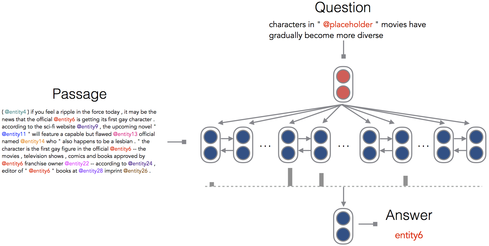

# CNN/Daily Mail Reading Comprehension Task

Code for the paper:

[A Thorough Examination of the CNN/Daily Mail Reading Comprehension Task](https://arxiv.org/pdf/1606.02858v2.pdf).



## Dependencies
* Python 2.7
* Theano >= 0.7
* Lasagne 0.2.dev1

## Datasets
* The two processed RC datasets:
    * CNN: [http://cs.stanford.edu/~danqi/data/cnn.tar.gz](http://cs.stanford.edu/~danqi/data/cnn.tar.gz) (546M)
    * Daily Mail: [http://cs.stanford.edu/~danqi/data/dailymail.tar.gz](http://cs.stanford.edu/~danqi/data/dailymail.tar.gz) (1.4G)

    The original datasets can be downloaded from [https://github.com/deepmind/rc-data](https://github.com/deepmind/rc-data) or [http://cs.nyu.edu/~kcho/DMQA/](http://cs.nyu.edu/~kcho/DMQA/).
    Our processed ones are just simply concatenation of all data instances and keeping document, question and answer only for our inputs.

* Word embeddings:
    * glove.6B.zip: [http://nlp.stanford.edu/data/glove.6B.zip](http://nlp.stanford.edu/data/glove.6B.zip)

## Usage

### Training
```
    THEANO_FLAGS=mode=FAST_RUN,device=gpu,floatX=float32
    python main.py --train_file /u/nlp/data/deepmind-qa/cnn/train.txt
                   --dev_file /u/nlp/data/deepmind-qa/cnn/dev.txt
                   --embedding_file /u/nlp/data/deepmind-qa/word-embeddings/glove.6B.100d.txt
```


### Hyper-parameters
* `relabeling`: default is True.
* `hidden_size`: default is 128.
* `bidir`: default is True.
* `num_layers`: default is 1.
* `rnn_type`: default is "gru".
* `att_func`: default is "bilinear".
* `batch_size`: default is 32.
* `num_epoches`: default is 100.
* `eval_iter`: default is 100.
* `dropout_rate`: default is 0.2.
* `optimizer`: default is "sgd".
* `learning_rate`: default is 0.1.
* `grad_clipping`: default is 10.


## Reference
```
    @inproceedings{chen2016thorough,
        title={A Thorough Examination of the CNN/Daily Mail Reading Comprehension Task},
        author={Chen, Danqi and Bolton, Jason and Manning, Christopher D.},
        booktitle={Association for Computational Linguistics (ACL)},
        year={2016}
    }
```

## License
MIT
